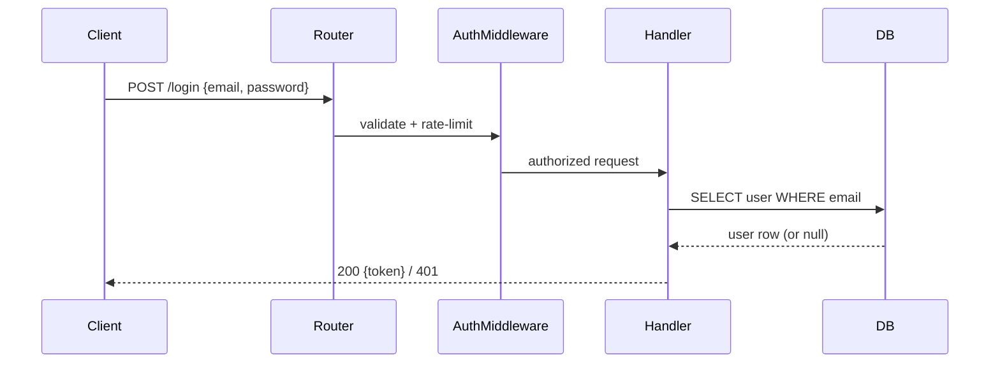

# Codebase Book

Produce a **reference-grade book** about a codebase. The bar is not "a nice overview."
The bar is: **after reading this book, a competent engineer can answer virtually any
question about the system — design rationale, architecture, data flow, edge cases,
failure modes, and implementation details — without going back to search the source.**

If a plausible question about the system cannot be answered from the book, the book is
not done.

## Definition of done (the contract)

The book must let a reader answer questions across **eight categories**. Treat these as
the north star for every chapter and the audit pass:

1. **Purpose & domain** — What does the system do? Who uses it? What problem does it
   solve? What are the core domain concepts and their meanings *in this codebase*?
2. **Architecture** — What are the major components? How are they separated and why?
   What are the boundaries, layers, and the direction of dependencies?
3. **Design rationale** — *Why* is it built this way? What trade-offs, constraints, and
   alternatives shaped it? What are the invariants the system must preserve?
4. **Control & data flow** — For every important operation, what is the exact
   step-by-step path through the code, with real inputs and outputs?
5. **Interfaces & contracts** — What are the public APIs, function signatures, events,
   schemas, and their pre/postconditions, validation rules, and error semantics?
6. **State & data** — What is the data model? What are the entities, fields, relations,
   lifecycles, and persistence rules? What state exists and how does it transition?
7. **Failure, edge cases & security** — What can go wrong? How are errors handled and
   propagated? What are the concurrency, retry, timeout, and auth/permission models?
8. **Operations & change** — How do you run, configure, test, debug, and extend it?
   Where would you make a given change, and what would break if you got it wrong?

A chapter is only finished when it answers every one of these categories that applies
to its subject.

## Golden rules

1. **Grounded, never hallucinated.** Read the code before describing it. Every
   non-trivial claim cites a real file (and line/symbol when possible). If behavior is
   unclear, read more. If it stays unclear, write "This is unclear from the code, but
   the likely behavior is … (inference)" — labeled explicitly as inference. Never
   invent an answer to look complete.
2. **Depth over breadth of prose, completeness over sampling.** For the "answer
   anything" goal you cannot skip subsystems. Cover them all; go deep on the ones that
   carry real logic. A file that is pure boilerplate gets a sentence; a file with the
   core algorithm gets a full walkthrough.
3. **Explain the why before the how, and the how before the what.** Rationale first,
   mechanism second, line-level detail last — but include all three.
4. **Trace real examples with real values.** Abstract descriptions are forgettable.
   Walk one concrete request/job/event through the system with plausible concrete data.
5. **Contracts and invariants are first-class.** For each component, state its inputs,
   outputs, preconditions, postconditions, and the invariants it must never violate.
   These answer the "what happens if…" questions.
6. **Write for a specific reader.** Default: "a strong engineer who just joined and has
   never seen this repo, and who will be on call for it." Define jargon on first use.
7. **Map-reduce for scale, audit for completeness.** Explore in slices, outline, write
   per chapter, then run the question-driven audit to find and fill gaps.

## Process

### Phase 0 — Survey (build the map)

Understand the shape before writing anything.

- Detect language(s), framework(s), package manager, build system, and run/entry points
  (`package.json`, `pyproject.toml`, `go.mod`, `Cargo.toml`, `pom.xml`, `Makefile`,
  `Dockerfile`, `docker-compose.yml`, CI configs).
- Find the real **entry points**: `main`, server bootstrap, CLI root, routers, request
  handlers, background jobs/cron, message/queue consumers, scheduled tasks.
- Identify **subsystems/domains** from both the directory layout *and* how code actually
  clusters (imports, shared types, call graphs). Prefer domain boundaries
  ("Authentication", "Billing", "Sync Engine") over folder names when they differ.
- Locate the **data model**: schemas, migrations, ORM models, core types, serialization.
- Locate **cross-cutting concerns**: config, logging, error handling, auth middleware,
  feature flags, telemetry, caching, transactions.

Use the `codebase-explorer` agent to map slices **in parallel**. Keep its structured
findings as your grounded source material.

### Phase 1 — Coverage map (guarantee nothing is skipped)

Before outlining, build an explicit **coverage map**: a checklist of every meaningful
code cluster (directory/package/module group) and every entry point. Assign each to a
chapter. This is your accountability ledger — you will confirm at the end that every
item is either covered in depth or explicitly marked "boilerplate / not load-bearing."
Do not let anything fall through silently.

### Phase 2 — Outline (design the Table of Contents)

Draft the ToC as a story that builds. A strong default:

1. **Start Here** — the 10-minute onboarding (spec below).
2. **The Big Picture** — architecture, boundaries, dependency direction, top diagram.
3. **Core Concepts & Domain Model** — the vocabulary and mental model of the system.
4. **One chapter per subsystem/domain** — ordered foundational → dependent. Each is a
   deep dive (spec below).
5. **Data Model & Persistence** — entities, relations, lifecycles, migrations.
6. **Key Flows** — end-to-end walkthroughs of the most important journeys, each with a
   sequence diagram and a concrete traced example.
7. **Cross-Cutting Concerns** — config, error handling, logging, auth, concurrency,
   caching, transactions — how they work everywhere.
8. **Failure Modes & Edge Cases** — what breaks, how it's handled, what's fragile.
9. **How Do I…? (cookbook)** — common change recipes grounded in real files.
10. **Glossary** — domain and codebase-specific terms.

Present the ToC + coverage map to the user for a quick confirm, then write.

### Phase 3 — Deep write (chapter by chapter)

Write each chapter as its own Markdown file. Apply the **depth ladder** (below) to every
subsystem. For each chapter, extract and document every applicable item from the
**extraction checklist**:

- **Responsibility** — what this owns, and explicitly what it does *not*.
- **Why it exists** — the problem it solves; the design decision and its trade-offs;
  alternatives that were plausible and why this one likely won (label inferences).
- **Public surface** — the functions/classes/endpoints/events it exposes, with real
  signatures, parameters, return types, and side effects.
- **Contracts** — preconditions, postconditions, validation rules, and invariants.
- **Mechanism** — how it works internally, step by step, citing code, with a trimmed
  excerpt (5–20 lines) of the load-bearing logic.
- **Data & state** — the state it holds/reads/writes and how that state transitions.
- **Collaborators** — what it calls, what calls it, and the shape of those interactions.
- **Errors & edge cases** — failure modes, error propagation, retries, timeouts, empty/
  boundary/concurrent inputs, and what happens on each.
- **Concurrency & ordering** — sync/async model, locks, races, idempotency, ordering
  guarantees (if any).
- **Security** — authz/authn touchpoints, trust boundaries, input handling, secrets.
- **Performance** — hot paths, complexity, caching, N+1 risks, known bottlenecks.
- **Config & env** — settings, env vars, feature flags that change behavior.
- **Tests** — where it's tested and what the tests assert (tests are executable specs —
  mine them for intended behavior and edge cases).
- **Gotchas** — non-obvious behavior, tight coupling, footguns, TODO/FIXME/HACK notes.

Chapter shape:
- Open with "What you'll be able to answer after this chapter" (tie to the 8 categories).
- Rationale → mechanism → detail. At least one **Mermaid diagram** where a flow or
  relationship exists. At least one **concrete traced example** for load-bearing logic.
- Close with **"Where to look"** (the key files) and **"Open questions"** (anything the
  code did not make clear).

### Phase 4 — Question-driven audit (the completeness loop)

This is what makes the book able to "answer anything." After a full draft exists:

1. Invoke the `book-auditor` agent. It generates a battery of hard questions across all
   eight categories — design *and* implementation, including nasty edge-case and
   "what happens if…" questions — and checks whether the book answers each, grounded in
   the actual code.
2. The auditor returns a **gap list**: unanswered questions, unsupported claims, and
   thin sections.
3. **Fill every gap**: read the relevant code and expand the chapters. Do not close the
   loop by weakening the questions — close it by improving the book.
4. Repeat until the auditor reports no material gaps.

### Phase 5 — Quizzes (active recall)

A book you read passively fades; a short, rigorous quiz after each chapter forces active
recall and turns reading into understanding. Generate quizzes **after the audit passes**
(so questions are grounded in a correct book) using the `quiz-master` agent.

For each chapter, produce a quiz that:

- **Tests understanding, not trivia.** Questions target the same eight categories the
  chapter teaches — especially design rationale, control/data flow, contracts, and
  "what happens if…" edge cases. Never quiz incidental facts (an exact variable name, a
  line number) unless it is genuinely load-bearing.
- **Is grounded and verifiable.** Every question has exactly one defensible correct
  answer supported by the chapter and the real code. The answer key cites `path:line`,
  so the quiz doubles as review.
- **Mixes question types** (see Quiz specs below): recall, trace-the-flow, predict /
  what-happens-if, design-rationale (short answer), and locate-the-change.
- **Uses plausible distractors** — real misconceptions, not silly filler. No "all/none
  of the above" as a crutch.
- **Labels difficulty** (`[Recall]` / `[Apply]` / `[Design]`) so readers can self-pace.

Also produce a **Final Exam** that interleaves questions across chapters and adds a few
end-to-end scenario questions ("trace this request"; "you must add X — where and why?").
Interleaving across chapters is what cements durable understanding.

The `quiz-master` self-checks every question (exactly one correct answer, grounded,
unambiguous, plausible distractors, tests understanding) and discards or rewrites any
that fail. Quizzes are on by default; skip them only if the user passes `--no-quiz`.

### Phase 6 — Assemble & verify

- Write `README.md` = the Table of Contents with links and one-line chapter summaries.
- Cross-link chapters (concepts should hyperlink to where they're defined/used), and
  link each chapter to its quiz (and the quizzes back to their chapter).
- Verify every file reference resolves and every Mermaid block is valid.
- Confirm the coverage map: every cluster is covered or explicitly marked non-load-
  bearing.
- Report the ToC, the coverage summary, and any residual open questions to the user.

## The depth ladder (per subsystem)

Push each important subsystem down the ladder as far as it warrants. Load-bearing
subsystems should reach the bottom rung.

1. **Name & one-line purpose.**
2. **Responsibilities & boundaries** — owns / doesn't own.
3. **Public interface** — real signatures and contracts.
4. **Internal mechanism** — step-by-step, with code excerpts.
5. **State & data transitions.**
6. **Failure modes, edge cases, concurrency, security.**
7. **Design rationale & trade-offs** — why this shape, what it costs.
8. **Traced example** — one concrete run with real values, end to end.

## Techniques that make the book answer-complete

- **Trace with real values.** "A user posts `{email, password}` to `/login` →
  `validateBody()` rejects if email is malformed (`auth/schema.ts:22`) → …". Concrete
  beats abstract.
- **Tests as spec.** Read the tests; they encode intended behavior and edge cases the
  prose might miss. Fold those cases into "Errors & edge cases."
- **Contrast the alternative.** "This uses optimistic locking rather than a mutex,
  which trades occasional retries for higher throughput (inference)." Rationale like
  this answers most design questions.
- **Follow the mutation.** For any piece of state, document who writes it, who reads it,
  in what order, and what invariant protects it.
- **Annotate excerpts.** When you paste code, add inline `// →` notes explaining the
  non-obvious lines, rather than pasting it bare.

## Mermaid cheat sheet

Use fenced ` ```mermaid ` blocks.

- **Architecture / dependency direction** — `flowchart LR`.
- **Runtime flow across components** — `sequenceDiagram`.
- **Data model** — `erDiagram`.
- **Lifecycles / state machines** — `stateDiagram-v2`.

````

````

## Anti-patterns (do not do these)

- ❌ Restating file/function names without explaining behavior ("`UserService` handles
  users"). Say *what it actually does and how*.
- ❌ Hand-waving over the hard parts ("it does some processing and returns a result").
  The hard parts are exactly what the reader needs.
- ❌ Pasting whole files. Excerpt the load-bearing 5–20 lines and annotate them.
- ❌ Silent gaps. If you skip something, say why (e.g. "generated code, not edited by
  hand").
- ❌ Confident invention. Unverifiable claims must be labeled inference or left as an
  open question.

## Quality bar — final self-test

Before declaring done, confirm you could answer each of these *from the book alone*:

- [ ] Why does the system exist and what are its core domain concepts?
- [ ] What are the major components, their boundaries, and why they're separated?
- [ ] For each important operation, what is the exact step-by-step flow?
- [ ] What are the public contracts, and what happens on invalid/edge/concurrent input?
- [ ] What is the full data model and how does state transition?
- [ ] What are the failure modes, error handling, retry/timeout, and auth models?
- [ ] Why was each significant design decision made, and what did it trade off?
- [ ] How do I run, configure, test, and extend it, and where would a given change go?
- [ ] Does each chapter have a grounded quiz whose answers cite real code (unless `--no-quiz`)?
- [ ] Does the final exam interleave across chapters rather than just repeat them?
- [ ] Did the `book-auditor` report zero material gaps?
- [ ] Is the coverage map fully accounted for?

If any box is unchecked, the book is not finished — keep going.

## Scaling & depth modes

- **`--depth quick`** (optional user request): overview-grade — Start Here, Big Picture,
  one lighter chapter per subsystem, key flows. Skips the exhaustive audit. Use only if
  the user explicitly wants a fast pass.
- **`--depth deep`** (default for this skill): the full contract above, including the
  question-driven audit loop. This is what "answer anything" requires.
- **Quizzes:** on by default in every mode; pass `--no-quiz` to skip. They are generated
  after the audit so they are grounded in a correct book. In `quick` mode, generate a
  short quiz per chapter and skip the final exam.
- **Huge repos:** you still cover everything, but calibrate prose length to load-bearing-
  ness. Use many parallel `codebase-explorer` runs; don't serialize.
- **Refresh mode:** if `book/` exists, regenerate only chapters whose underlying files
  changed, then re-run the audit on those chapters.
- **Monorepos:** each package/app is a "Part" with its own chapters, plus a cross-cutting
  "How the packages fit together" chapter.

## Output layout

Write into the output directory (default `./book`):

```
book/
├── README.md                     # Table of Contents + coverage summary
├── 00-start-here.md
├── 01-the-big-picture.md
├── 02-core-concepts.md
├── 03-<subsystem>.md
├── ...
├── NN-data-model.md
├── NN-key-flows.md
├── NN-cross-cutting-concerns.md
├── NN-failure-modes.md
├── NN-how-do-i.md
├── NN-glossary.md
└── quizzes/                      # active-recall quizzes (on by default)
    ├── 00-start-here-quiz.md
    ├── 01-the-big-picture-quiz.md
    ├── ...                        # one per chapter, cross-linked both ways
    └── NN-final-exam.md           # interleaved across all chapters
```

Number chapters so they sort in reading order.

## Chapter specs

### "Start Here" (the most important chapter)

The reader is productive in 10 minutes. Include:
- **What is this?** One paragraph: what the system does and who uses it.
- **Run it locally** — the actual verified commands (from scripts/config, not guessed).
- **The mental model** — the 3–5 concepts you must hold in your head to reason about it.
- **Where things live** — a short map of the top-level directories.
- **Your first change** — a concrete "to do X, edit Y, because Z."

### "The Big Picture"

- A top-level architecture diagram (`flowchart`).
- Major components, boundaries, and the direction of dependencies.
- The load-bearing architectural decisions and trade-offs (label inferences as such).
- A "how a typical request/job flows at a high level" paragraph that later chapters zoom
  into.

## Quiz specs (active recall)

Quizzes live in a `quizzes/` folder, one file per chapter plus a final exam, cross-linked
from each chapter ("→ Check your understanding: quizzes/03-...-quiz.md") and from the book
README.

**Per-chapter quiz** (5–10 questions):
- Open with a one-line "how to use" (try closed-book first; then check answers and reread
  the cited code).
- Mix these question types:
  - **Recall / comprehension (MCQ)** — the core concept or contract.
  - **Trace-the-flow** — "Given input X, what is the order of steps / final result?"
  - **Predict / what-happens-if (MCQ or short)** — edge cases, errors, concurrency.
  - **Design rationale (short answer)** — "Why X instead of Y? What does it trade off?"
  - **Locate-the-change (short answer)** — "To do Z, which file/function do you edit?"
- Put all **answers + explanations below a `---` divider**, each citing `path:line` with
  1–2 sentences on why the answer is right and the distractors are wrong.
- Tag each question `[Recall]`, `[Apply]`, or `[Design]`.

**Final exam** (`quizzes/NN-final-exam.md`):
- 15–25 questions **interleaved across all chapters**, weighted toward load-bearing
  subsystems and key flows.
- Include 2–4 **scenario questions**: multi-step "trace this end to end" or "here's a
  change request — where does it go, what could break?"
- Same grounded answer key with citations.

**Quiz quality bar** (every question must pass):
- [ ] Exactly one defensible correct answer.
- [ ] Answer is grounded in the chapter/code (cite `path:line`).
- [ ] Distractors are plausible misconceptions, not filler.
- [ ] Tests understanding of why/how/edge cases, not incidental trivia.
- [ ] Unambiguous wording; no trick phrasing.
